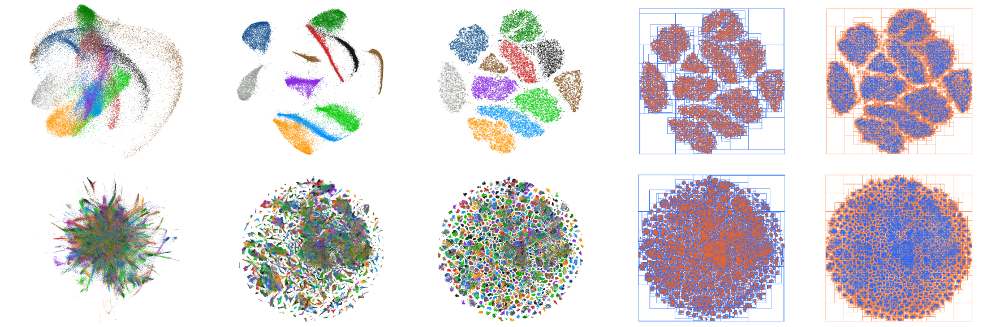
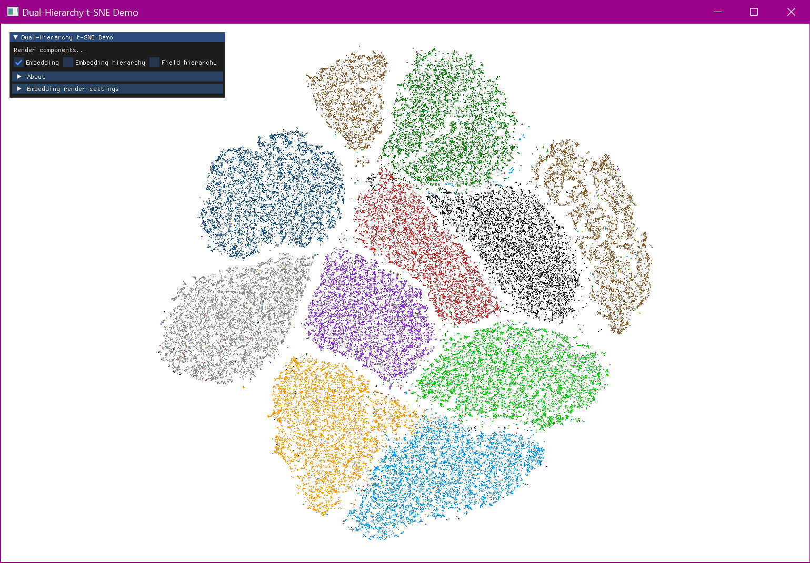

# Dual-hierarchy t-SNE



## Introduction

This repository contains a library and accompanying demo application implementing our dual-hierarchy acceleration of *t-distributed Stochastic Neighbor Embedding* ([t-SNE](https://lvdmaaten.github.io/tsne/)). For details and performance comparisons, check out our recent paper "*An Efficient Dual-Hierarchy t-SNE Minimization*" ([journal link](https://ieeexplore.ieee.org/abstract/document/9552856), [author link](https://graphics.tudelft.nl/Publications-new/2021/VBE21/)).

Our method accelerates the t-SNE minimization by generating a pair of spatial hierarchies; one over the embedding, and another over a discretization of the embedding's space.
We consider approximations of the interactions between these hierarchies, allowing us to significantly reduce the number of N-body computations performed.
Our method runs fully on the GPU using OpenGL/CUDA, and currently outperforms GPU implementations of both FIt-SNE [[1]](#1) and linear-complexity t-SNE [[2]](#2). Finally, it scales to 3D embeddings as well.

## Compilation
Ensure your system satisfies the following requirements:
* A C++17 compiler. (tested with MSVC 19.6, Clang 12, GCC 11)
* CMake 3.21 or later.
* CUDA 10 or later.

All other dependencies are bundled through vcpkg. Note that some Unix systems may require X11/Wayland development packages to be installed for [GLFW](https://www.glfw.org). Vcpkg tries to provide sufficient information for you to install these, but if you run into any issues, refer to the [GLFW compilation page](https://www.glfw.org/docs/3.3/compile.html).

Next, clone the repository (including submodules) and configure it using CMake. For example:

```bash
  git clone --recurse-submodules https://github.com/Markvanderuit/dual_hierarchy_tsne
  mkdir dual_hierarchy_tsne/build
  cd dual_hierarchy_tsne/build
  cmake ..
  make
```
Note that, on the very first run of any application including the built libraries, CUDA's compute cache is still being built for FAISS. The KNN search hence may take a very long time on a first run.

## Usage

**Library**

The CMake project provides three library build targets: *utils*, *vis*, and *sne*.
The *utils* library contains utility and boilerplate code.
The optional *vis* library contains rendering code for the demo application discussed below.
The *sne* library contains the only parts that really matter.
Below is a minimal example showing its usage to minimize a small dataset:

```c++
#include <vector>
#include "dh/sne/params.hpp"
#include "dh/sne/sne.hpp"

int main() {
  using namespace dh::sne;

  // 1. Create Params object 
  //    For all parameters, refer to: include/dh/sne/params.hpp
  Params params;
  params.n = 60000;                   // Dataset size
  params.nHighDims = 784;             // Dataset dimensionality
  params.nLowDims = 2;                // Embedding dimensionality (2 or 3)
  params.iterations = 1000;           // Nr. minimization iterations
  params.perplexity = 30.0f;          // Perplexity parameter
  params.dualHierarchyTheta = 0.25f;  // Approximation parameter

  // 2. Create and load high-dimensional dataset
  //    I'm skipping dataset loading code for this example
  std::vector<float> dataset(params.n * params.nHighDims);

  // 3. Construct SNE object
  //    This manages all gpu objects, state, computation, etc.
  SNE sne(dataset, params);

  // 4. Perform similarities computation and minimization
  //    For expanded examples of using the SNE class, such as
  //    doing minimizations step-by-step, refer to:
  //    a. the SNE header: include/dh/sne/sne.hpp
  //    b. the demo application: src/app/sne_cmd.cpp
  sne.comp();

  // 5. Obtain KL-divergence and embedding data
  float kld = sne.klDivergence();
  std::vector<float> embedding = sne.embedding();

  return 0;
}
```

**Demo application**

The demo (build target: `sne_cmd`, file: `src/app/sne_cmd.cpp`) provides a command-line application which can run t-SNE on arbitrary datasets, if they are provided in a raw binary (single-precision floating point) format. It additionally allows for starting a tiny renderer (the `vis` library) that shows the embedding, minimization, and the used dual-hierarchies.

Below is a basic example using an MNIST dataset with labels. The following line:

```bash
./sne_cmd <path/to/mnist.bin> 60000 784 2 --lbl --kld
```
performs a 2D embedding of the 60.000x784 dataset, outputting something like the following:
```bash
KL-divergence : 1.28378
Similarities runtime : 2248ms
Minimization runtime : 1164ms
```
Adding either the `--visDuring` or `--visAfter` parameters spawns a renderer during/after minimization:
 


The renderer can visualize the dual-hierarchies used in our technique, if you check the `Embedding hierarchy`/`Field hierarchy` flags in the UI. Note that `--visDuring` may slow down the actual minimization, especially if large hierarchies are used.

You can use `./sne_cmd -h` to list all other program parameters. Common parameters are perplexity (`-p`, default 30), number of iterations (`-i`, default 1000), Barnes-Hut approximation (`-t`, default 0.25), and output file (`-o`). Adding `--lbl` indicates the input dataset contains labels, while `--kld` indicates KL-divergence should be computed afterwards.

**Datasets**

A test dataset (MNIST: 60.000x784 with labels) is provided in a compressed file [here](resources/data). In our paper, we additionally used the following datasets:

* [Fashion-MNIST](https://surfdrive.surf.nl/files/index.php/s/ErqzvT1WdIk1tBp) 60.000x784, with labels. Original from [zalandoresearch/fashion-mnist](https://github.com/zalandoresearch/fashion-mnist).
* [ImageNet](https://surfdrive.surf.nl/files/index.php/s/EkjTCi2M6s4Gelo) 1.281.167x128, with labels. Original from [ZJULearning/AtSNE](https://github.com/ZJULearning/AtSNE).
* [Word2Vec](https://surfdrive.surf.nl/files/index.php/s/O1lrFqYq4e1Y80o) 3.000.000x128, without labels. Original from the [Word2Vec website](https://drive.google.com/file/d/0B7XkCwpI5KDYNlNUTTlSS21pQmM/edit?resourcekey=0-wjGZdNAUop6WykTtMip30g).

## Citation
Please cite the following paper if you found it useful in your research:

```
@article{
  author = {van de Ruit, Mark and Billeter, Markus and Eisemann, Elmar},
  title = {An Efficient Dual-Hierarchy t-SNE Minimization},
  journal = {IEEE Transactions on Visualization and Computer Graphics}, 
  year = {2021},
  doi = {10.1109/TVCG.2021.3114817}}
}
```

## License and third-party software
The source code in this repository is released under the MIT License. However, all used third-party software libraries are governed by their own respective licenes. Without the following libraries, this project would have been considerably harder: 
[cxxopts](https://github.com/jarro2783/cxxopts),
[cub](https://github.com/NVIDIA/cub),
[date](https://github.com/HowardHinnant/date),
[dear ImGui](https://github.com/ocornut/imgui),
[faiss](https://github.com/facebookresearch/faiss),
[glad](https://glad.dav1d.de/),
[GLFW](https://www.glfw.org/),
[GLM](https://glm.g-truc.net/0.9.9/),
[indicators](https://github.com/p-ranav/indicators),
[vcpkg](https://github.com/microsoft/vcpkg).

## References

<a id="1">[1]</a> 
Linderman, G. C., Rach, M., Hoskins, J. G., Steinerberger, S., and Kluger, Y. (2017).
*Efficient Algorithms for t-distributed stochastic neighbor embedding*.


<a id="2">[2]</a> 
Pezotti, N., Mordvintsev, A., Höllt, T., Lelieveldt, B. P. F., Eisemann, E. and Vilanova, A. (2018).
*Linear t-SNE optimization for the web*.
